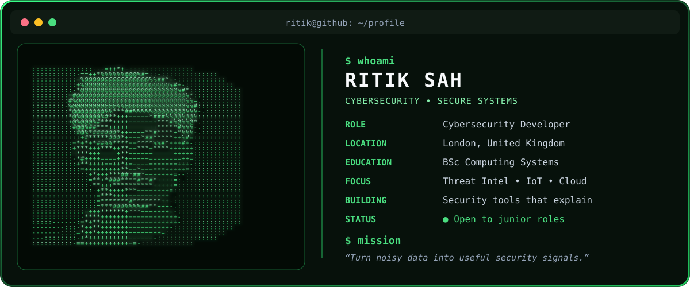
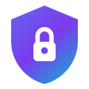

I build security-focused systems that turn noisy technical data into clear, useful signals. My work spans machine-learning anomaly detection, cyber-threat intelligence, secure application architecture, and structured risk assessment.

## Featured projects

<table>
<tr>
<td width="50%" valign="top">

### [IoTSentinel](https://github.com/ritiksah141/iotsentinel)

A Raspberry Pi home-network monitor that learns normal device behaviour, detects anomalies, and explains alerts in plain English.

`Python` `Machine Learning` `Network Security` `Raspberry Pi`

</td>
<td width="50%" valign="top">

### [ThreatVault](https://github.com/ritiksah141/ThreatVault)

A scalable, cloud-native evidence and multimedia-sharing platform designed for security professionals.

`Cloud Native` `Security` `Full Stack` `Evidence Management`

</td>
</tr>
<tr>
<td width="50%" valign="top">

### [BreachLens](https://github.com/ritiksah141/BreachLens)

A full-stack cyber-threat intelligence platform for tracking dark-web breaches, mapping global attacks, and monitoring compromised assets.

`Flask` `Angular` `MongoDB` `Docker`

</td>
<td width="50%" valign="top">

### DUSK

Co-owned with **TFTT44** and currently in active development. More project details will be published when the repository becomes publicly available.

`Co-owner` `In Development` `Security Engineering`

</td>
</tr>
</table>

## Open-source project

<table>
<tr>
<td width="18%" align="center" valign="middle">

</td>
<td width="82%" valign="middle">

### [OpenShield](https://openshield.org)

Open-source Cloud Security Posture Management for Azure—a community-driven alternative to commercial CSPM platforms.

`Python` `Azure` `Cloud Security` `CSPM` `Open Source`

</td>
</tr>
</table>

## Security toolkit

## GitHub activity

---

### Let's build safer systems.

Explore my repositories, connect on [LinkedIn](https://linkedin.com/in/ritik-sah), or visit my [portfolio](https://portfolio-lilac-ten-41.vercel.app/).

