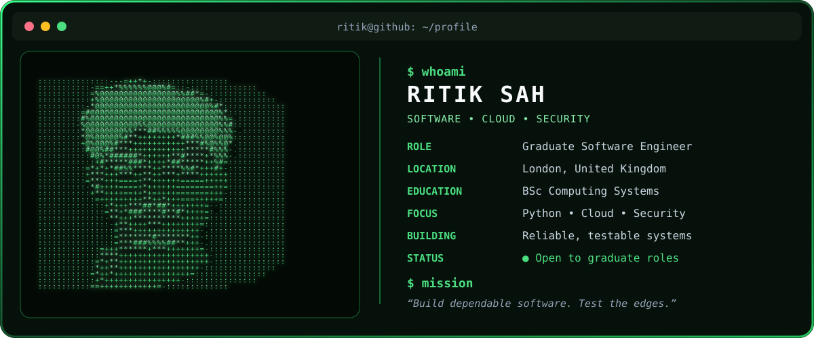

<div align="center">



[](https://portfolio-lilac-ten-41.vercel.app/)
[](https://www.linkedin.com/in/ritik-sah-858015335/)
[](mailto:ritiksah141@gmail.com)
[](https://github.com/ritiksah141)

</div>

I am a final-year Computing Systems student and open-source maintainer building dependable software for cloud and security use cases. I work across Python backends, REST APIs, Azure, CI/CD, automated testing and full-stack delivery.

My strongest work sits where software reliability and security meet: turning requirements into reviewable code, designing useful failure states, and proving behaviour beyond the happy path. I am currently seeking UK graduate and junior roles in software engineering, Python backend, cloud/platform engineering and security engineering.

## Engineering work

<table>
<tr>
<td width="50%" valign="top">

### [OpenShield](https://github.com/OWASP/openshield)

Open-source Azure Cloud Security Posture Management that finds misconfigurations and quantum-unsafe cryptography, maps evidence to compliance frameworks, and provides remediation guidance.

I maintain the API and AI areas, contribute backend tests, and review CI and infrastructure changes.

[](https://github.com/OWASP/openshield/blob/dev/MAINTAINERS.md)
[](https://github.com/OWASP/openshield)

`Python` `Flask` `Azure` `GitHub Actions` `Security controls`

</td>
<td width="50%" valign="top">

### [DUSK](https://github.com/ShieldTech-Ltd/DUSK)

A vendor-neutral runtime gate that evaluates proposed AI-agent actions against behavioural history before those actions reach a protected system.

Co-built with Tanvir Farhad, with policy decisions, trace evidence, watch and enforce modes, and cloud-neutral deployment work.

[](https://github.com/superlinked/sie/tree/main/examples/agent-action-monitor)
[](https://github.com/ShieldTech-Ltd/DUSK)

`Python` `AI agent security` `Policy gates` `Docker` `Observability`

</td>
</tr>
<tr>
<td width="50%" valign="top">

### [IoTSentinel](https://github.com/ritiksah141/iotsentinel)

A local-first Raspberry Pi appliance that makes home networks more visible through device discovery, vulnerability posture, traffic analysis and plain-English alert explanations.

[](https://iotsentinel.org/)
[](https://github.com/ritiksah141/iotsentinel)

`Python` `Raspberry Pi` `Network monitoring` `Online learning` `Testing`

</td>
<td width="50%" valign="top">

### [BreachLens](https://github.com/ritiksah141/BreachLens)

A full-stack threat-intelligence platform for breach tracking, compromised-asset monitoring and privacy-preserving exposure checks, backed by an automated OSINT pipeline.

[](https://github.com/ritiksah141/BreachLens)

`Flask` `Angular` `MongoDB` `Redis` `Docker`

</td>
</tr>
</table>

## What I bring

```text
$ cat engineering-profile.txt

BACKEND      Python services, Flask APIs, SQL and data workflows
CLOUD        Azure systems, container delivery and deployment automation
QUALITY      Unit, integration and regression testing with CI quality gates
SECURITY     Application security, cloud posture and runtime policy controls
DELIVERY     Git, GitHub Actions, Docker, Linux and technical documentation
APPROACH     Clear boundaries, explicit failure states and evidence over claims
```

## Working stack

<div align="center">


</div>

## Open-source evidence

- **OpenShield:** listed as the [API and AI maintainer](https://github.com/OWASP/openshield/blob/dev/MAINTAINERS.md), responsible for the API, AI layer, CI and infrastructure review, and backend tests.
- **Superlinked SIE:** DUSK is published as a self-contained [agent-action-monitor example](https://github.com/superlinked/sie/tree/main/examples/agent-action-monitor), with explicit architecture, tests, sample data and deployment limitations.
- **Project engineering:** public repositories document the decisions, tests and trade-offs behind IoTSentinel, BreachLens and ThreatVault.

## GitHub activity

<div align="center">

<!-- This healthy summary-card endpoint replaces the retired activity-graph deployment. -->


</div>

---

<div align="center">

### Build reliable systems. Secure them by design.

[Explore my work](https://portfolio-lilac-ten-41.vercel.app/) · [Connect on LinkedIn](https://www.linkedin.com/in/ritik-sah-858015335/) · [Email me](mailto:ritiksah141@gmail.com)


</div>
